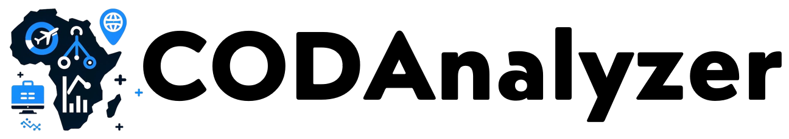

# Africa COD Market Analysis Dashboard

## Solution Name: CODAlyzer



CODAlyzer is a simple Streamlit app designed to empower e-commerce strategists in selecting the ideal African market for Cash On Delivery (COD) strategies. By leveraging specific country-level data, users can explore and analyze various metrics to identify markets with the most significant potential for COD implementation.

**Note:** The app provides initial features to analyze about the african countries that influences the choice of the suitable target market for COD.

### Key Features:

- **Dynamic Metric Selection**: Choose from a range of economic and demographic metrics to focus your analysis such as:
    * Population
    * Average Age
    * GDP per Capita (in $)
    * Merchant Marine ()
    * Number of Internet Users
    * Internet Users (%)
    * Unemployment Rate (%)

- **Interactive Sliders**: Adjust criteria thresholds to filter countries based on selected metrics.
- **Comprehensive Visualization**: View a multi-bar plot displaying selected metrics for each country, enabling easy comparison and decision-making.
- **Data-Driven Insights**: Utilize cached, up-to-date data for speedy and informed market analysis.

### Getting Started

To run CODAlyzer on your local machine, follow these steps:

1. **Clone the Repository**

    ```
    git clone https://github.com/AterhiM/CODAnalyzer.git
    cd CODAnalyzer
    ```

2. **Set Up Your Environment**

    Ensure you have Python 3.6+ installed on your system. It's recommended to use a virtual environment:

    ```
    python -m venv venv
    source venv/bin/activate # On Windows, use `venv\Scripts\activate`
    ```

3. **Install Requirements**

    Install the required Python packages using the `requirements.txt` file:

    ```
    pip install -r requirements.txt
    ```

4. **Run the App**

    Launch CODAlyzer by running:

    ```
    streamlit run ./code/app.py
    ```

5. **Explore the Dashboard**

    Use the sidebar to select metrics and set your criteria. The dashboard will dynamically update to show you the filtered countries and plot their metrics for easy comparison.

### Data Source

The app uses a dataset containing various economic and demographic metrics for African countries from multiple sources ( **statista.com** and **cia.gov**).

### Contributing

We welcome contributions and suggestions to make CODAlyzer more useful for e-commerce strategists. Feel free to fork the repository, make your changes, and submit a pull request.

### License

See the LICENSE file for details.

Cheers!
made by @therealaterhi
